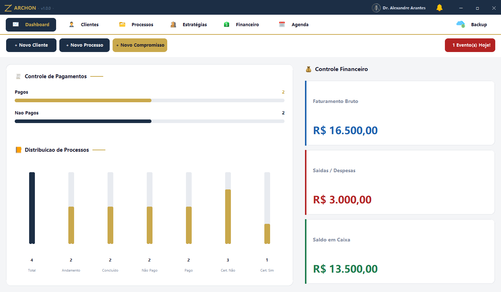
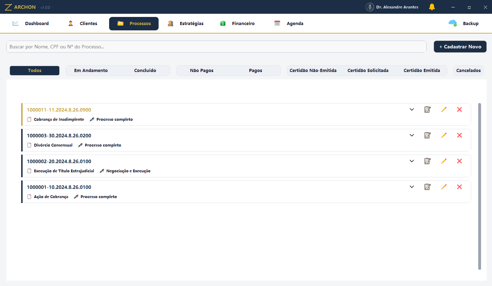
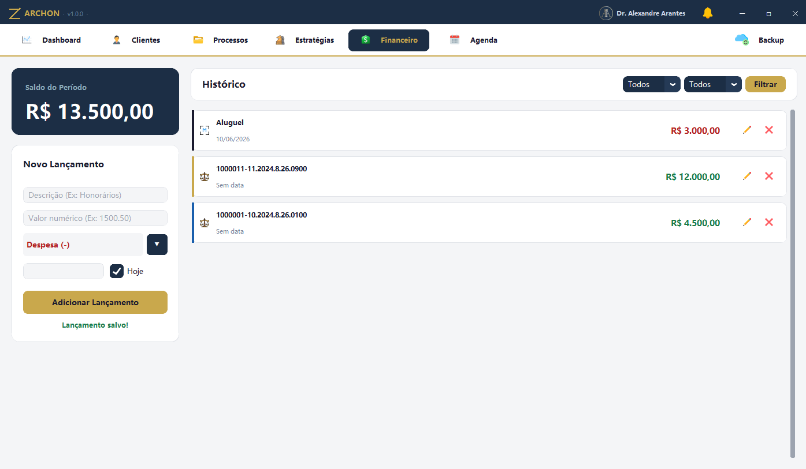
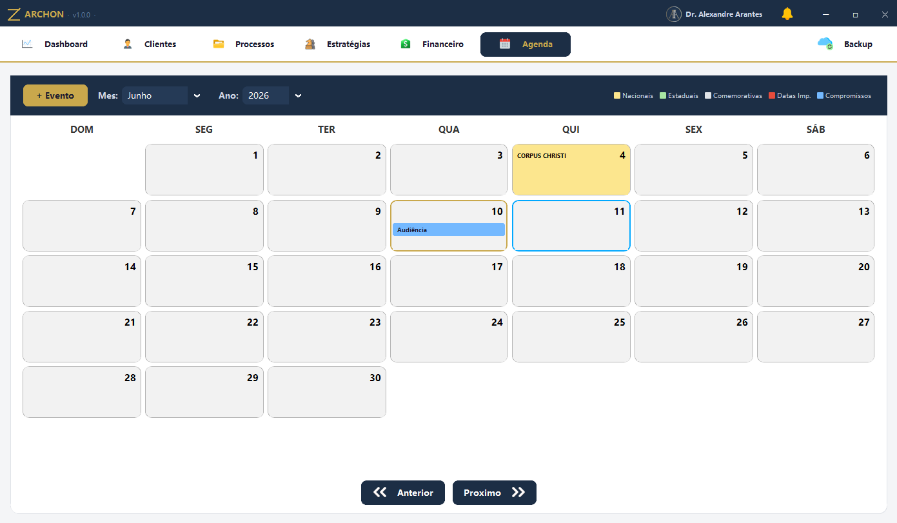

<div align="center">

# ⚖️ ARCHON ⚖️

**Sistema desktop completo de gestão jurídica para advogados.**

Gestão de clientes, processos, honorários, estratégias, financeiro e agenda — em uma interface premium, leve e 100% offline.


</div>

---

## 📸 Screenshots

> Todos os dados exibidos são **fictícios**, gerados pelo `seed_demo.py`.

| Dashboard | Processos |
|---|---|
|  |  |

| Financeiro | Calendário |
|---|---|
|  |  |

---

## ✨ Funcionalidades

**Gestão completa**
- **Dashboard** com indicadores de pagamentos, distribuição de processos e saúde financeira em tempo real
- **Clientes** PF e PJ com formulários dinâmicos, máscaras automáticas (CPF, CNPJ, RG, telefone) e cards expansíveis
- **Processos** com numeração CNJ validada (formato + duplicidade), status multi-aba, honorários por porcentagem, valor fixo parcelado ou pro bono
- **Associações entre processos** com navegação cruzada (processo ↔ cliente ↔ processo associado)
- **Estratégias** vinculadas a processos, com níveis de urgência e checklist de plano de ação
- **Financeiro** com lançamentos automáticos (processos pagos) e manuais, filtros por mês/ano
- **Calendário** com feriados nacionais, compromissos, datas importantes e alertas no dashboard
- **Backup** com um clique: exporta todos os dados para Excel formatado, com comentários nas células

**Experiência de uso**
- Janela **frameless** com titlebar customizada (arrastar, maximizar com snap, minimizar via Windows API)
- **System tray**: fechar minimiza para a bandeja, mantendo o sistema acessível
- **Instância única**: clicar no ícone com o app aberto traz a janela existente para frente (Mutex do Windows)
- **Splash screen** animada na inicialização
- Central de **notificações** com sino e badge de contagem
- Identidade visual própria: paleta navy & dourado, ícones customizados

---

## 🛠️ Stack & Arquitetura

| Camada | Tecnologia |
|---|---|
| Interface | [CustomTkinter](https://github.com/TomSchimansky/CustomTkinter) + Pillow |
| Persistência | SQLite (zero configuração, 100% offline) |
| Integração Windows | `ctypes` (Win32 API: taskbar, ícones, mutex, UAC) |
| Bandeja do sistema | pystray |
| Exportação | openpyxl |
| Empacotamento | PyInstaller + Inno Setup (instalador `.exe` completo) |

```
projeto/
├── main.py                  # Janela principal, titlebar, tray, backup
├── seed_demo.py             # Popula o banco com dados fictícios p/ demo
├── database/
│   └── database.py          # Toda a camada de acesso a dados (SQLite)
├── modules/
│   ├── layout.py            # Notificações e componentes compartilhados
│   ├── dashboard.py         # Indicadores e gráficos
│   ├── clientes.py          # CRUD de clientes PF/PJ
│   ├── processos.py         # CRUD de processos + associações
│   ├── estrategias.py       # Planos estratégicos por processo
│   ├── financeiro.py        # Lançamentos e filtros
│   ├── calendario.py        # Agenda com feriados
│   └── utils.py             # Máscaras e formatadores
├── assets/                  # Ícones da interface
├── styles/
│   └── theme_premium.json   # Tema CustomTkinter customizado
├── Archon.spec              # Build PyInstaller
└── Archon_Setup.iss         # Script do instalador Inno Setup
```

---

## 🚀 Rodando em modo desenvolvimento

```bash
# 1. Clone o repositório
git clone https://github.com/SEU_USUARIO/archon-advocacia-digital.git
cd archon-advocacia-digital

# 2. Crie o ambiente virtual e instale as dependências
python -m venv .venv
.venv\Scripts\activate
pip install -r requirements.txt

# 3. (Opcional) Popule com dados de demonstração
python seed_demo.py

# 4. Execute
python main.py
```

---

## 📦 Gerando o executável + instalador

```bash
# 1. Gerar o executável
pyinstaller Archon.spec

# 2. Compilar o instalador (requer Inno Setup 6)
# Abra Archon_Setup.iss no Inno Setup Compiler e pressione F9
# O instalador final sai em Output/Archon_Setup.exe
```

O instalador cria atalhos, registra o ícone no Painel de Controle e oferece
inicialização automática com o Windows.

---

## 🧠 Desafios técnicos interessantes

- **Janela frameless funcional no Windows**: `overrideredirect(True)` remove a janela da taskbar e quebra minimizar/Alt+Tab. Resolvido manipulando extended styles (`WS_EX_APPWINDOW`) e ícones (`WM_SETICON`) direto na Win32 API via `ctypes`.
- **Instância única**: Mutex nomeado do kernel; segunda execução localiza a janela original com `FindWindowW` e a traz para frente em vez de abrir duplicada.
- **Caminhos em executável congelado**: PyInstaller extrai assets em `sys._MEIPASS`; toda carga de recursos passa por um resolvedor de caminhos compatível com dev e produção.
- **Snap de arrastar maximizado**: arrastar a janela maximizada a restaura proporcionalmente sob o cursor, replicando o comportamento nativo do Windows.

---

## 👨‍💻 Autor

Desenvolvido por **Guilherme Teles** · [LinkedIn](https://www.linkedin.com/in/guilherme-gomes-arantes-teles-2ab1a622b/) · [GitHub](https://github.com/teleesDev)

> Projeto desenvolvido sob demanda para um escritório de advocacia real.
> Todos os dados neste repositório e nas capturas de tela são fictícios.

---

<div align="center">
<sub>⚖️ ARCHON ⚖️ · © 2026 Guilherme Teles</sub>
</div>
